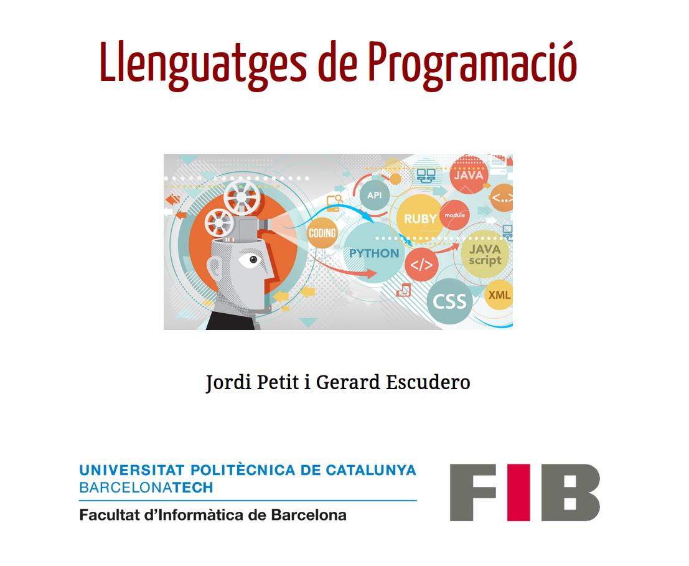
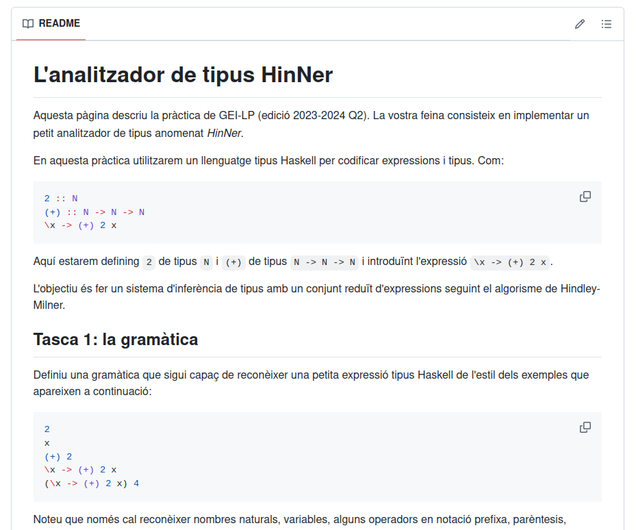
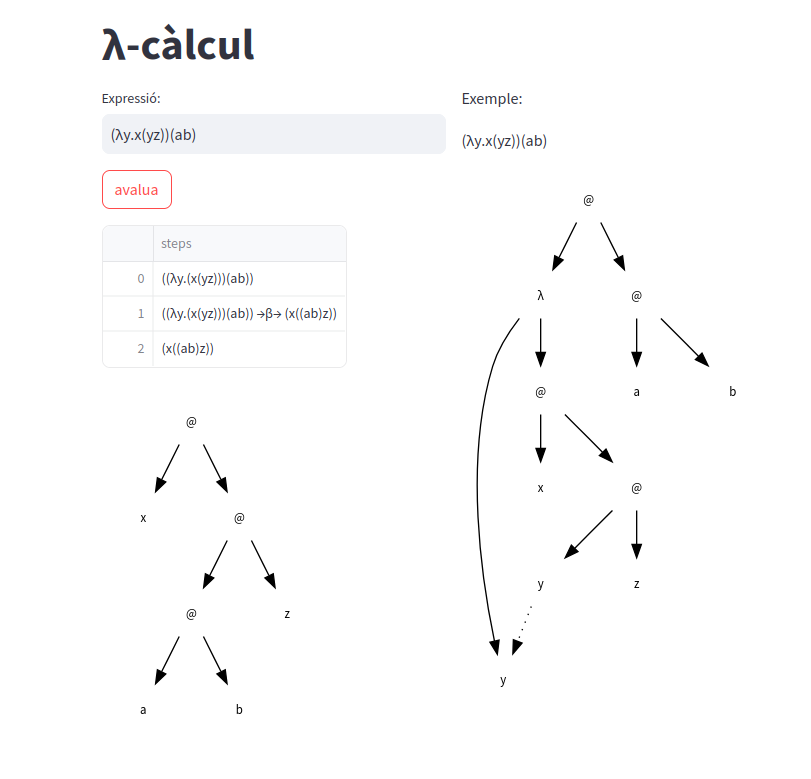

class: center, middle

# Recursos Educatius Oberts

.center[
<br>
font: [cliparts.co](https://cliparts.co/clipart/3300025)
]

<br>

**Gerard Escudero**

Departament de Ciències de la Computació

Universitat Politècnica de Catalunya

---
class: left, middle, inverse

## Contingut

- .cyan[Components i eines]

- Continguts en *markdown*

- Exemples pràctics

---

# Components i eines

- .blue[Edició de continguts]

  - Processadors de textos o generadors de transparències

  - Llenguatges de programació o generadors multimèdia

  - ...

- .blue[Hostatjat dels continguts]

  - Atenea, UPCommons, Apren...

  - Webs (departament, grup de recerca...)

  - ...

- .blue[Llicències]

  - Creative Commons, MIT...

---

# Les meves opcions

- .blue[Transparències]: markdown (+css), github

.center[<br>
[font](https://github.com/gebakx/lp) / [vista](https://gebakx.github.io/lp/#1)]

---

# Les meves opcions

- .blue[Documents]: markdown, github

.center[<br>
[font](https://github.com/gebakx/lp-achurch-23)]

- .blue[Documentació]: [Game AI for Unity](https://gebakx.github.io/gameAIUnity/)

---

# Les meves opcions

- .blue[Demos]: python (+streamlit), huggingFace

.center[<br>
[font](https://huggingface.co/spaces/gebakx/lambdaCalcul/tree/main) / [vista](https://huggingface.co/spaces/gebakx/lambdaCalcul)]

---

# Característiques

- Treball en el núvol

- Edició cooperativa amb control de versions

- Fàcil d'utilitzar i aprendre

- Hostatjat

- Compatible amb: Github, Gits, Atenea, Webs...

- Ús de programari obert

- Accés mitjançant un navegador

### Software

- Editor de text, navegador, [git](https://git-scm.com/), [jekyll](https://jekyllrb.com/)

- github / atenea / web

---
class: left, middle, inverse

## Contingut

- .brown[Components i eines]

- .cyan[Continguts en *markdown*]

- Exemples pràctics

---

## Portada

.cols5050[
.col1[

]
.col2[
```makdown
class: center, middle

# Llenguatges de Programació

<br>


<br><br>

**Jordi Petit i Gerard Escudero**

<br>


---
```
]]

---

## Taules

```makdown
class      | sepLen | sepWid | petLen | petWid 
:--------- | -----: | ----: | -----: | ----: 
setosa     | 5.1    | 3.5   | 1.4    | 0.2 
setosa     | 4.9    | 3.0   | 1.4    | 0.2 
versicolor | 6.1    | 2.9   | 4.7    | 1.4 
versicolor | 5.6    | 2.9   | 3.6    | 1.3 
virginica  | 7.6    | 3.0   | 6.6    | 2.1 
virginica  | 4.9    | 2.5   | 4.5    | 1.7 
```

class      | sepLen | sepWid | petLen | petWid 
:--------- | -----: | ----: | -----: | ----: 
setosa     | 5.1    | 3.5   | 1.4    | 0.2 
setosa     | 4.9    | 3.0   | 1.4    | 0.2 
versicolor | 6.1    | 2.9   | 4.7    | 1.4 
versicolor | 5.6    | 2.9   | 3.6    | 1.3 
virginica  | 7.6    | 3.0   | 6.6    | 2.1 
virginica  | 4.9    | 2.5   | 4.5    | 1.7 


---

## Fórmules Latex


- Distància **euclidiana**:

```markdown
$$de(v, w) = \sqrt{\sum_{i=1}^n(v_i-w_i)^2}$$
```

$$de(v, w) = \sqrt{\sum_{i=1}^n(v_i-w_i)^2}$$

## Codi

```python
def suma(a, b):                # python
  return a + b
```

```clojure
(defn suma [a b]               ; clojure
  (+ a b))
```

```haskell
suma :: Int -> Int -> Int     -- haskell
suma a b = a + b      
```

---
class: left, middle, inverse

## Contingut

- .brown[Components i eines]

- .brown[Continguts en *markdown*]

- .cyan[Exemples pràctics]

---

.cols5050[
.col1[
### Xerrada

- [Recursos Educatius Oberts](https://gebakx.github.io/reo-eebe-2024)


### Assignatures

- [Llenguatges de programació](https://gebakx.github.io/lp/#1)

- [Conceptes avançats de programació (laboratori)](https://gebakx.github.io/cap/#1)

- [Introduction to Human Language Technologies (laboratori)](https://gebakx.github.io/ihlt/#1)

- [Game AI for Unity](https://github.com/gebakx/gameAIUnity)

- [Machine Learning](https://gebakx.github.io/ml/)
]
.col2[
### Demos

- [Demo Xarxa Neuronal sobre Iris](https://huggingface.co/spaces/gebakx/iris)

- [Calculadora λ-càlcul](https://huggingface.co/spaces/gebakx/lambdaCalcul)

### Enunciat de pràctiques

- [Analitzador HinNer 2023](https://github.com/gebakx/lp-hinner-24)

- [PandaQ 2023](https://github.com/gebakx/lp-pandaQ-23)

- [L'intèrpret de λ-càlcul AChurch](https://github.com/gebakx/lp-achurch-23)

]]
